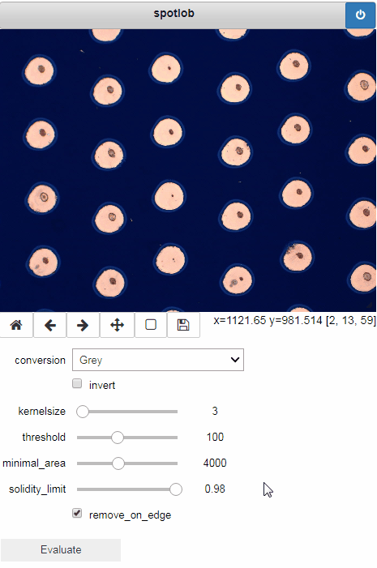

Basic workflow
==============

Spotlob can be used in various ways: as a library to be integrated
in another software, as a framework for development of a image detection
task or as a software for semi-automated feature detection for
easy up to moderately difficult detection tasks. The following suggested
workflow adresses the latter.

1. Tweak parameters using the notebook
--------------------------------------

Finding a parameter set for an arbitrary feature detection task can be
challenging. The approach of spotlob is to use the interactive features
of Jupyter to facilitate the tweaking of parameters towards a detection.
If you have Jupyter installed, open the `notebooks/simple gui.ipynb` notebook
file. Insert the path the image that you wish to analyze:

.. code-block:: python

    filename = "path/to/your/file.jpg"

Then run all the cells up to `show_gui(gui)`. An interactive image preview
should appear an you can play around with the sliders. A change of
parameter values will be reflected as a preview. Once you press `Evaluate`,
the contours are analyzed.

The result of the analysis can be requested as a dataframe with

.. code-block:: python

    gui.results()

2. Store and reload a pipeline
------------------------------

The pipeline holds all the information of the detection - applying the
same pipeline on the same image should always yield the same results.
A pipeline can be saved to a file, to repeat the same detection later.

To save the parameters and selection of processes, that has been
used in the gui, access the pipeline object through the `gui.pipeline` field
and then store it:

.. code-block:: python

    mypipe = gui.pipeline
    mypipe.save("my_pipe.pipe")

To restore a saved pipeline object

.. code-block:: python

    from spotlob.pipeline import Pipeline

    restored_pipe = Pipeline.from_file("my_pipe.pipe")

3. Batch processing
-------------------

If you have multiple image files, that you wish to evaluate all the same way,
you can use the `batch` module to apply a saved pipeline on all
of them and get the results collected in a single dataframe.

.. code-block:: python

    from spotlob.batch import batchprocess

    results = batchprocess("my_pipe.pipe",
                           ["file1.jpg",... , "fileN.jpg"],
                           multiprocessing=True)

If the `multiprocessing` parameter is set `True`, all available cpu cores
are used for parallel execution, giving a significant speedup on
multi-core systems.
